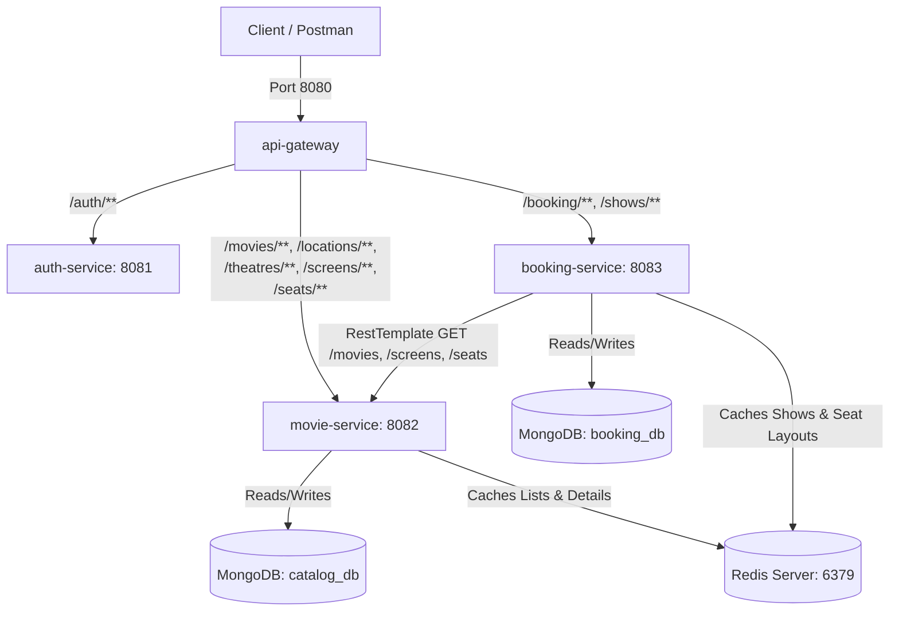

# API Gateway, Catalog, Booking Service & Redis Caching Optimization - Day 07

This repository contains a secure, production-ready **Microservices Architecture** with MongoDB persistence, centralized routing via API Gateway, Role-Based Access Control (RBAC), transactional seat locking to prevent double bookings, and optimized read performance using **Redis Caching**.

---

## System Architecture



1. **`api-gateway` (Port 8080)**: Central gateway that intercepts client requests, performs JWT signature checks, and propagates authorization details (`X-User-Email`, `X-User-Role`) downstream.
2. **`auth-service` (Port 8081)**: Issue-point for user signup/login and JWT credentials generation.
3. **`movie-service` (Port 8082)**: Handles MongoDB CRUD operations for Locations, Theatres, Screens, Seats, and Movies. Caches frequently read lists and detail lookups in Redis.
4. **`booking-service` (Port 8083)**: Manages movie screening schedules (Shows), dynamic seat layouts, and ticket purchases with atomic locking to prevent double bookings. Caches show details and seat availability layout in Redis, invalidating them programmatically upon state transitions.

---

## Service Port & MongoDB / Redis Configurations

| Service Name | Port | Database / Cache | Authentication |
| :--- | :--- | :--- | :--- |
| **`api-gateway`** | `8080` | None | N/A (Token Validation Point) |
| **`auth-service`** | `8081` | H2 (In-memory) | Public |
| **`movie-service`** | `8082` | MongoDB (`catalog_db`) & Redis (`localhost:6379`) | Secured (Requires Gateway Headers) |
| **`booking-service`**| `8083` | MongoDB (`booking_db`) & Redis (`localhost:6379`) | Secured (Requires Gateway Headers) |

---

## Redis Caching & Consistency Strategy

To optimize system read operations, Redis caching is applied to high-read APIs across the services.

### 1. Serialization
Custom `RedisConfig` classes are configured in both `movie-service` and `booking-service` to use `GenericJackson2JsonRedisSerializer`. The configured `ObjectMapper` is enhanced with the `JavaTimeModule` to serialize/deserialize Java 8 time classes (e.g. `LocalDate` and `LocalDateTime`) cleanly and registers polymorphic type info (`NON_FINAL`) to facilitate seamless class conversion.

### 2. Caching Policies

#### Movie Catalog Service (`movie-service`)
*   **`movies_list`** (Key: `{page, size, sortBy, direction}`): Caches the complete paginated movie list. Evicted on movie creation, updates, and deletion (`allEntries = true`).
*   **`movies_search`** (Key: `{title, genre, page, size, sortBy, direction}`): Caches search results. Evicted on movie creation, updates, and deletion (`allEntries = true`).
*   **`movies`** (Key: `#id`): Caches single movie lookups. Evicted on movie updates and deletion.
*   **`theatres_list`** (Key: `{locationId, page, size, sortBy, direction}`): Caches the paginated theatres list. Evicted on theatre creation, updates, and deletion (`allEntries = true`).
*   **`theatres`** (Key: `#id`): Caches single theatre lookups. Evicted on theatre updates and deletion.

*Note: Since Spring Data's `PageImpl` lacks default creators for Jackson deserialization, a custom `RestPage<T>` wrapper is implemented to handle paginated results cleanly when retrieved from Redis.*

#### Booking Service (`booking-service`)
*   **`shows_list`**: Caches show listings. Evicted on show creation.
*   **`shows`** (Key: `#id`): Caches single show lookups.
*   **`seats`** (Key: `#showId`): Caches seat layout availability for a specific show. 
    *   **Eviction Policy**: Crucial for consistency. Because seat status changes frequently during booking states (`LOCKED`, `BOOKED`, `AVAILABLE`), the `seats::showId` cache is evicted immediately when a user initiates a lock (`/booking/lock`), confirms a booking (`/booking/confirm`), or cancels a booking (`/booking/cancel`).

---

## Role-Based Access Control (RBAC)

Access is granted based on roles forwarded by the Gateway:

| Resource Path | HTTP Method | Allowed Roles | Service |
| :--- | :--- | :--- | :--- |
| `/locations/**` | `GET` | `USER`, `THEATRE_OWNER`, `ADMIN` | `movie-service` |
| `/locations/**` | `POST`, `PUT`, `DELETE` | `ADMIN` only | `movie-service` |
| `/theatres/**`, `/screens/**`, `/seats/**`, `/movies/**` | `GET` | `USER`, `THEATRE_OWNER`, `ADMIN` | `movie-service` |
| `/theatres/**`, `/screens/**`, `/seats/**`, `/movies/**` | `POST`, `PUT`, `DELETE` | `THEATRE_OWNER`, `ADMIN` | `movie-service` |
| `/shows/**` | `GET` | `USER`, `THEATRE_OWNER`, `ADMIN` | `booking-service` |
| `/shows/**` | `POST` | `THEATRE_OWNER`, `ADMIN` | `booking-service` |
| `/booking/**` | `GET`, `POST` | `USER`, `THEATRE_OWNER`, `ADMIN` | `booking-service` |

---

## Booking Flow & Seat Locking Logic

### 1. Booking Workflow States
Bookings cycle through the following states:
`INITIATED` (Temporary hold on seats) ➔ `CONFIRMED` (Booking purchased successfully) or `CANCELLED` (Hold released).

### 2. Double-Booking Prevention (Atomic Locking)
To prevent two concurrent threads from booking the same seat:
- Individual seat states are stored in the `show_seats` collection with an ID of `showId_seatId`.
- Each seat has a status of `AVAILABLE`, `LOCKED` (temporary for 5 minutes), or `BOOKED`.
- When reserving seats (`POST /booking/lock`), the service runs an **atomic update** using MongoDB's `findAndModify` command:
  ```java
  Query query = new Query(Criteria.where("_id").is(showSeatId)
          .orOperator(
                  Criteria.where("status").is("AVAILABLE"),
                  Criteria.where("status").is("LOCKED").and("lockedUntil").lt(LocalDateTime.now()),
                  Criteria.where("status").is("LOCKED").and("userEmail").is(currentUserEmail)
          ));
  Update update = new Update()
          .set("status", "LOCKED")
          .set("lockedUntil", LocalDateTime.now().plusMinutes(5))
          .set("userEmail", currentUserEmail);
  ```
- If `findAndModify` returns `null` for any of the requested seats, the seat is already occupied or held by another user. The transaction fails immediately, rollback logic releases any seats locked during that call, and a `400 Bad Request` is returned to the user.

---

## Running the Architecture Locally

Ensure you have **MongoDB** running on port `27017` (`mongod`), **Redis** running on port `6379` (`redis-server`), along with **Java 17**.

Start the services in individual terminals:
```bash
# 1. Start Redis Server
redis-server

# 2. Run Auth Service
cd auth-service && ./mvnw spring-boot:run

# 3. Run Movie Service (Catalog)
cd movie-service && ./mvnw spring-boot:run

# 4. Run Booking Service
cd booking-service && ./mvnw spring-boot:run

# 5. Run API Gateway
cd api-gateway && ./mvnw spring-boot:run
```

---

## Running Caching Verification Tests

Automated integration tests check Redis caching and eviction mechanisms:

```bash
# Verify Movie Catalog caching & page serialization
cd movie-service && ./mvnw test

# Verify Booking seat-layout caching and eviction
cd booking-service && ./mvnw test
```

---

## Testing API Endpoints (via Port 8080 Gateway)

### 1. Register & Login Users (Public Routes)
Register different accounts. Use `POST /auth/register` then `POST /auth/login` to obtain the corresponding **Bearer Tokens**.

---

### 2. Show Scheduling (THEATRE_OWNER or ADMIN only)
- **POST `/shows`**
```json
{
  "movieId": "<paste_movie_mongodb_id>",
  "screenId": "<paste_screen_mongodb_id>",
  "startTime": "2026-06-17T18:00:00",
  "endTime": "2026-06-17T20:30:00"
}
```
*Creates show, fetches details from movie-service via RestTemplate, and generates the layout of available seats in the booking database.*

- **GET `/shows`**
  Fetch all created screening times.

---

### 3. Seat Layout Map (All Roles)
- **GET `/booking/show/{showId}/seats`**
  Returns dynamic layout of seats (AVAILABLE, LOCKED, or BOOKED) for the selected show.

---

### 4. Booking Flow APIs (All Roles)

#### Step A: Lock Seats (Initiate Booking)
- **POST `/booking/lock`**
```json
{
  "showId": "<paste_show_id>",
  "seatIds": ["seat-A1", "seat-A2"]
}
```
*Locks seats for 5 minutes and returns a booking document in `INITIATED` status with calculated totalPrice.*

#### Step B: Confirm Booking (Complete Purchase)
- **POST `/booking/confirm`**
```json
{
  "bookingId": "<paste_booking_id>"
}
```
*Transitions seat status from LOCKED to BOOKED and marks booking as `CONFIRMED`.*

#### Step C: Cancel Booking / Release Hold
- **POST `/booking/cancel`**
```json
{
  "bookingId": "<paste_booking_id>"
}
```
*Releases locks, returning seats to AVAILABLE, and marks booking status as `CANCELLED`.*

#### Step D: Fetch User Bookings
- **GET `/booking`**
  Lists all booking history for the authenticated user.
